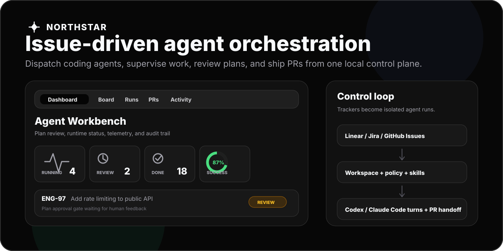

# Northstar

**Northstar is a local control plane for issue-driven coding-agent work.**

It watches Linear, Jira, or GitHub Issues, starts agent runs in isolated workspaces, injects the right workflow guidance, records telemetry, and gives humans a dashboard for review, retries, stop controls, dependency scans, and PR handoff.

<p align="center">
  
</p>

## Why Northstar

Coding agents are most useful when the work queue, runtime behavior, and handoff path are explicit. Northstar turns an issue tracker into an agent operations system:

- **Dispatch from real issues** - normalize Linear, Jira, or GitHub Issues into a consistent work model.
- **Run in contained workspaces** - create per-issue directories, lifecycle hooks, and scoped tool access.
- **Keep humans in the loop** - require plan approval, request revisions, reject runs, and post feedback back to the tracker.
- **See what happened** - inspect audit events, token usage, tool names, runtime status, and result snapshots.
- **Ship the output** - create or reuse GitHub pull requests with configured labels, reviewers, draft mode, and branch metadata.

Northstar is not a hosted agent platform. It is a TypeScript CLI and local HTTP dashboard that coordinates the runtimes, credentials, and repositories you already control.

## What It Does

```text
Issue tracker      WORKFLOW.md          Agent runtime
Linear             YAML config          Codex app server
Jira        -->    Liquid prompt   -->   Claude Code
GitHub            Skill profiles        Bedrock / Gemini experiments
                   Tool policy
                   Quality gates
                         |
                         v
               Isolated workspace
                         |
                         v
             Dashboard, audit trail, PR handoff
```

Core capabilities:

- Workflow loading with YAML front matter, Liquid prompt rendering, and hot reload.
- Tracker adapters for Linear, Jira, and GitHub Issues.
- Runtime adapters for Codex, Claude Code, Bedrock Anthropic, and Gemini.
- Dispatch ordering, concurrency limits, blocker checks, retries, reconciliation, and stalled-run restart.
- Prompt-level skill profiles selected globally or by issue label.
- Sequential quality gates for test, review, security, docs, or custom prompts.
- Tool policies with global and label-specific allow/deny rules.
- Approval gates with `/approve`, `/revise <feedback>`, and `/reject` tracker commands.
- Local React dashboard with Dashboard, Board, Runs, PRs, Activity, and Settings views.
- Drag-and-drop board moves for tracker-backed columns that allow manual movement.
- Audit trail, token telemetry, event streams, and runtime status surfaced through HTTP APIs.
- Optional LLM dependency scan across open issues.
- In-memory settings updates for runtime models and Jira JQL while the service is running.

## Quick Start

### Prerequisites

- Node.js 22 or newer.
- Credentials for at least one tracker: Linear, Jira, or GitHub.
- A local coding-agent runtime for live execution, such as Claude Code or Codex.

### 1. Install and verify

```bash
npm install
npm run build
npm test
```

### 2. Create a workflow

```bash
cp WORKFLOW.example.md WORKFLOW.md
```

Edit the YAML front matter in `WORKFLOW.md`:

- Set `tracker.kind` to `linear`, `jira`, or `github`.
- Set `runtime.kind` to `claude_code`, `codex_app_server`, `bedrock_anthropic`, or `gemini`.
- Set `workspace.root` to the parent directory for per-issue workspaces.
- Keep credentials as `$ENV_VAR` references. Northstar resolves them at startup.

### 3. Export credentials

Set only the variables your selected tracker, runtime, and integrations use.

| Variable | Used by |
| --- | --- |
| `LINEAR_API_KEY` | Linear tracker and Linear GraphQL integration tool |
| `JIRA_EMAIL` | Jira tracker and Jira REST integration tool |
| `JIRA_API_TOKEN` | Jira tracker and Jira REST integration tool |
| `GITHUB_TOKEN` | GitHub tracker, GitHub integration tool, and PR handoff |
| `ANTHROPIC_API_KEY` | Claude Code runtime when not using local auth |
| `GOOGLE_API_KEY` | Gemini runtime |
| `AWS_PROFILE` | Bedrock runtime |
| `SLACK_TOKEN` | Slack posting integration tool |
| `CONFLUENCE_API_TOKEN` | Confluence page integration tool |

### 4. Run Northstar

```bash
node dist/src/cli.js ./WORKFLOW.md --port 4000
```

Open the dashboard:

```text
http://127.0.0.1:4000/
```

Or call the API directly:

```bash
curl http://127.0.0.1:4000/api/v1/state
curl http://127.0.0.1:4000/api/v1/board
curl -X POST http://127.0.0.1:4000/api/v1/refresh
```

Omit `--port` for a single-pass tick that fetches issues, starts eligible runs, and exits when the active work finishes.

Once published or globally linked:

```bash
npx northstar ./WORKFLOW.md --port 4000
```

## Try The Dashboard With Mock Data

For UI development or a quick product tour, run the mock API and Vite dashboard in separate terminals:

```bash
npm run dev:mock
npm run dev:web
```

`npm run dev:mock` serves realistic fixture data on `http://127.0.0.1:4000`, including running agents, an awaiting-review plan, completed and failed runs, PR candidates, telemetry, and audit events. `npm run dev:web` starts the React dashboard and proxies API requests to that mock server.

## Workflow Files

`WORKFLOW.md` has YAML front matter followed by a Markdown prompt template. The YAML config selects trackers, runtimes, workspace behavior, server settings, board columns, integrations, skill profiles, policy, feedback, approval gates, and quality gates.

The Markdown body is rendered with Liquid and receives an `issue` object. Northstar appends deterministic issue context plus configured skill and gate instructions before sending the prompt to the selected runtime.

Start with [WORKFLOW.example.md](WORKFLOW.example.md).

## Runtime Support

Runtime selection is configured with `runtime.kind`.

| Runtime kind | Current behavior |
| --- | --- |
| `codex_app_server` | Runs the configured Codex app-server command for each turn. |
| `claude_code` | Runs the local `claude` CLI with stream JSON output. |
| `bedrock_anthropic` | Experimental SDK harness using Bedrock Converse and Northstar tool specs. |
| `gemini` | Experimental SDK harness using `generateContent` and Northstar tool specs. |

Codex and Claude Code are the most mature paths. Treat Bedrock and Gemini as experimental until you have verified them with your model, tools, and workspace policy.

## Tracker Support

Tracker selection is configured with `tracker.kind`.

| Tracker kind | Notes |
| --- | --- |
| `linear` | Uses Linear GraphQL, active and terminal state filters, project and assignee filters, pagination, and blocker normalization. |
| `jira` | Uses Atlassian Cloud REST v3 with endpoint, email, API token, project key, optional JQL, active states, and terminal states. |
| `github` | Uses GitHub REST API v3 for issues in one `owner/repo`, with optional label filtering. Pull requests are excluded automatically. |

## Human Review And Quality Gates

Northstar can keep implementation behind an explicit human review loop:

1. A matching issue runs a planning turn.
2. Northstar posts or stores the plan.
3. The issue waits for `/approve`, `/revise <feedback>`, or `/reject`.
4. Approved plans continue into implementation.
5. Quality gates run sequentially after implementation.

Built-in quality gate names include `test`, `review`, `security_review`, and `docs`. Unknown names become custom gate prompts.

Quality gates currently run sequentially in the same runtime session, not as parallel independent agents. See [ADR-005](docs/decisions/0005-sequential-quality-gates.md) for the design rationale.

## Dashboard And API

The local dashboard is backed by the HTTP API under `/api/v1`.

Common endpoints:

| Endpoint | Purpose |
| --- | --- |
| `GET /api/v1/state` | Runtime state, running issues, results, audit log, telemetry, retry queue, and awaiting review. |
| `GET /api/v1/board` | Kanban board snapshot built from tracker and runtime state. |
| `POST /api/v1/refresh` | Trigger a best-effort tracker refresh. |
| `POST /api/v1/issues/:identifier/stop` | Stop a running issue. |
| `POST /api/v1/issues/:identifier/retry` | Retry a failed or retryable issue. |
| `POST /api/v1/issues/:identifier/pr/create` | Create or reuse a configured GitHub pull request. |
| `POST /api/v1/dependencies/scan` | Run optional LLM dependency detection across issues. |
| `POST /api/v1/settings` | Change supported runtime and tracker settings in memory. |

Dashboard views:

- **Dashboard** - metrics, human review, model split, active runs, retry queue, audit trail.
- **Board** - configurable Kanban columns, drag-and-drop moves, bulk ticket actions.
- **Runs** - active runs and recent result event streams.
- **PRs** - PR-ready tickets and handoff actions.
- **Activity** - filterable audit log.
- **Settings** - in-memory runtime model and tracker filter adjustments.

## Architecture

```text
src/cli.ts
  |
  v
Workflow loader -> Tracker adapter -> Orchestrator tick
       |                |                 |
       |                |                 +-> Dispatch state, retry, reconciliation
       |                |                 +-> Workspace manager and lifecycle hooks
       |                |                 +-> Runtime adapter and tool policy
       |                |                 +-> Skill profile and quality gates
       |                |
       |                +-> Linear / Jira / GitHub issue normalization
       |
       +-> YAML config + Liquid prompt rendering

Observability server
  +-> state snapshots
  +-> board snapshots
  +-> dashboard assets
  +-> action endpoints
```

Key modules:

| Module | Purpose |
| --- | --- |
| `src/workflow/` | `WORKFLOW.md` loading, schema validation, watching, and prompt rendering |
| `src/tracker/` | Normalized issue model plus Linear, Jira, and GitHub adapters |
| `src/runtime/` | Runtime interface and Codex, Claude Code, Bedrock, and Gemini harnesses |
| `src/orchestrator/` | Dispatch, state, retry, reconciliation, approval gates, and sequencing |
| `src/workspace/` | Per-issue workspace creation, hooks, and cleanup |
| `src/tools/` | Integration contracts and runtime-specific tool adapters |
| `src/skills/` | Prompt-level skill sequence resolution |
| `src/quality/` | Sequential quality gate prompts |
| `src/context/` | Deterministic issue context assembly |
| `src/policy/` | Tool allow/deny filtering by label |
| `src/observability/` | HTTP server, snapshots, and dashboard serving |

## Documentation

- [Workflow example](WORKFLOW.example.md)
- [Operator dashboard and observability](docs/observability.md)
- [Dependency sequencing](docs/sequencer.md)
- [React UI components](docs/ui-components.md)
- [Architecture decision records](docs/decisions/)
- [Agent instructions](AGENTS.md)

## Development

Useful commands:

```bash
npm run build
npm test
npm run test:watch
npm run dev:mock
npm run dev:web
npm run spec:check
```

Production-style local check:

```bash
npm run build
node dist/src/cli.js ./WORKFLOW.md --port 4000
```

The Fastify server serves the built React app from `web/dist` when present. If the dashboard has not been built, the server returns a small diagnostic HTML page instead of failing mysteriously.

CI runs install, build, tests, and the conformance checklist through `.github/workflows/ci.yml`.

## Trust Posture

Northstar is designed for high-trust local development:

- Credentials should stay as environment-variable indirections in workflow files.
- Known secret keys are redacted from structured logs.
- Built-in file tools are scoped to the issue workspace.
- Runtime/tool execution is treated as a trust boundary.
- Northstar fails closed instead of prompting when runtime user input would be required.
